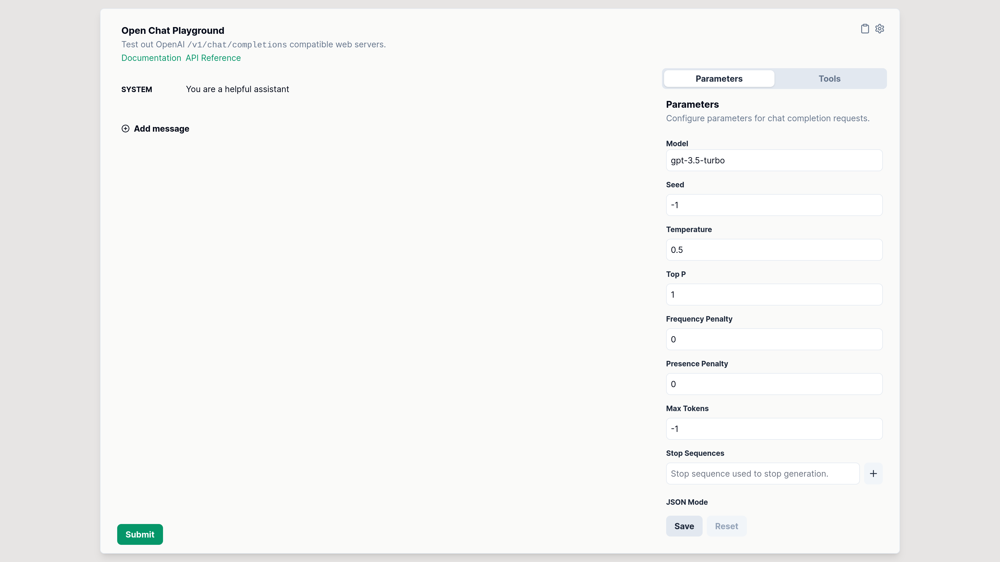

<p align="center">
  
</p>

# Open Chat Playground

[](https://abetlen.github.io/open-chat-playground)

Open Chat Playground is a single page application for experimenting with OpenAI `/v1/chat/completion` compatible web servers.

It provides a few additional features over OpenAI's Chat Playground including:

- Markdown Rendering
- Tool Calling
- Image Content
- Ability to call other backends

Try out the [hosted version](https://abetlen.github.io/open-chat-playground)

# Setup

```bash
git clone git@github.com:abetlen/open-chat-playground.git
cd open-chat-playground
npm install
npm run dev
```

Then just visit [http://localhost:3000/open-chat-playground](http://localhost:3000/open-chat-playground) in your browser.

# Connecting to Other API Providers (Cohere, Groq, Anthropic)

Many hosted services do not provide an OpenAI-compatible API though it's still possible to connect to them.
To connect to these providers you can use the [LiteLLMs OpenAI Proxy](https://github.com/BerriAI/litellm?tab=readme-ov-file#openai-proxy---docs) and then set the url in the Chat Playground settings.

## Example

```yaml
# litellm.config.yaml
model_list:
  - model_name: command-r
    litellm_params:
      model: command-r
      api_key: "os.environ/COHERE_API_KEY"
  - model_name: groq
    litellm_params:
      model: groq/llama2-70b-4096
      api_key: "os.environ/GROQ_API_KEY"
```

```bash
pip install litellm
litellm --config litellm.config.yaml
```

# License

This project is licensed under the MIT License.
